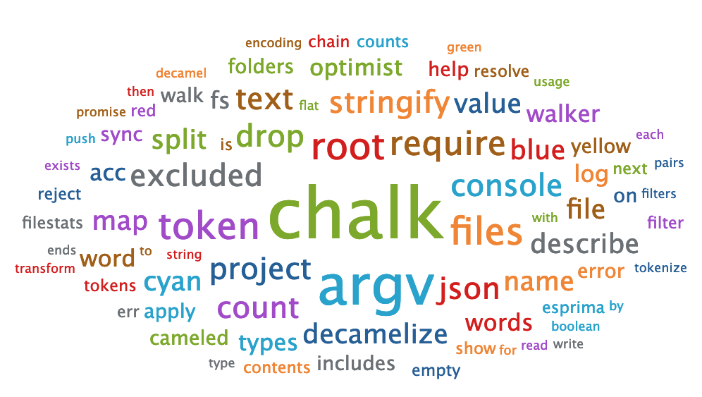

# code-cloud
Fun way to analyze a JavaScript project by creating word clouds

# Example
```
~/src/code-cloud> node index.js . --exclude-files data.js
Running with options:
    decamel:           true
    tokens:            ["Identifier"]
    drop:              ["",""]
    exclude-folders:   ["node_modules","coverage","tests"]
    exclude-files:     ["data.js"]

scanning .
processing ./index.js
```

